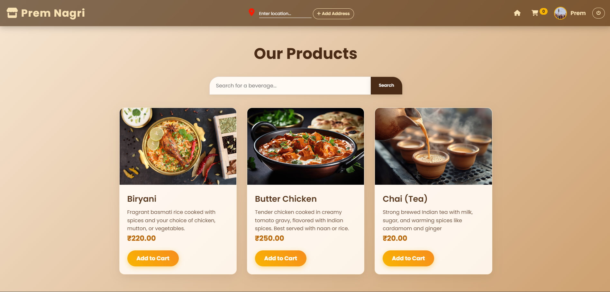
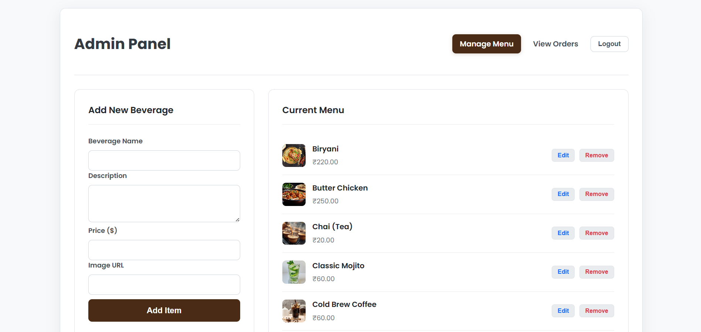
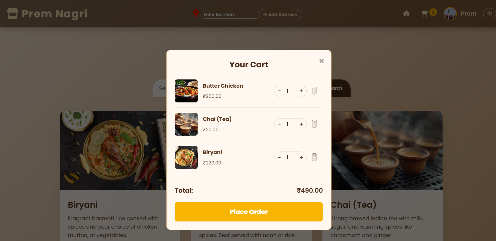
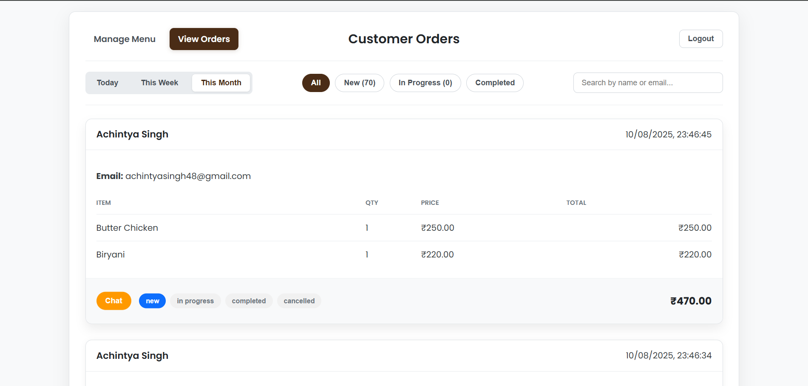
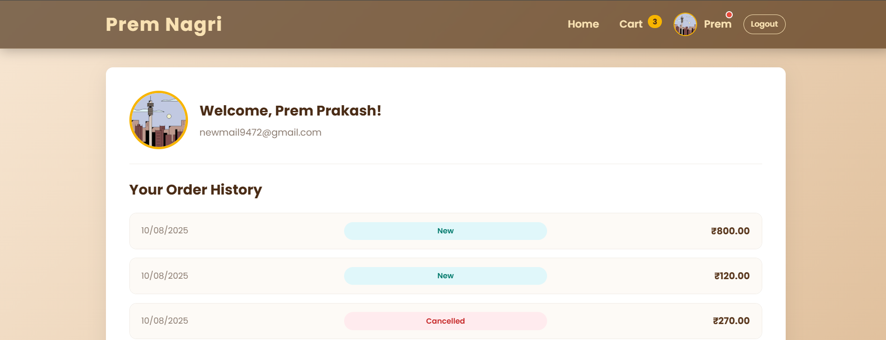
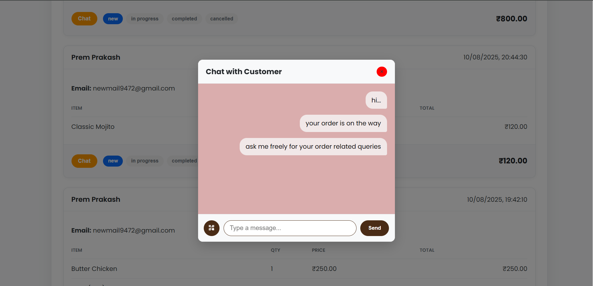

# 🍽 Prem Nagri – A Modern Restaurant Ordering Platform

Prem Nagri is a complete, commercial-grade, and fully responsive web application tailored for restaurants.  
It delivers a seamless ordering experience for customers and a powerful, secure management dashboard for administrators.  
Built from the ground up using modern web technologies with a focus on security, performance, and an excellent user experience.

<p align="center">
  <a href="https://mess-project.vercel.app/"></a>
  <a href="https://github.com/XYZcode94/mess_project"></a>
</p>


---

## 📸 Screenshots

| Customer Website            | Admin Panel               |
|----------------------------|--------------------------|
|   |  |
|  |         |
|  |                   |

---


## 📸 How This Page Works – Demo Screenshots

See how the Prem Nagri platform works through these screenshots and walkthroughs:

- [Homepage & Menu Browsing](https://www.dropbox.com/scl/fi/ky3qsfvie3269gogmmko6/Screenshot-2025-08-11-032926.png?rlkey=tfl5hgmzwa06q430qqqzcwrov&st=q77fxlie&dl=0)  
- [Shopping Cart & Checkout Process](https://your-image-hosting-link.com/cart-demo.png)  
- [User Profile & Order Tracking](https://your-image-hosting-link.com/profile-demo.png)  
- [Admin Dashboard & Order Management](https://your-image-hosting-link.com/admin-demo.png)  

*Click any link above to view full-size images and walkthroughs.*

---

Alternatively, you can embed images directly:

| Homepage | Cart & Checkout | Profile |
| -------- | --------------- | ------- |
|  |  |  |

---

If you want, I can help you create or host these screenshots/images with a suggested tool and generate the markdown for embedding.

---

## 🚀 Key Features

### 👩‍💻 Customer-Facing Website (`index.html`, `profile.html`)

- **High-Performance Menu**  
  Products are loaded in batches with a "Load More" button to ensure fast browsing.

- **Advanced Smart Search**  
  Client-side search supports partial matches, case-insensitive, and out-of-order word matching (e.g., searching "Chai Masala" finds "Masala Chai").

- **Search History**  
  Stores the last 5 unique searches locally for quick access.

- **Secure Customer Authentication**  
  Google Sign-In powered by Firebase Authentication.

- **Persistent Shopping Cart**  
  Cart saved in Firestore, enabling session continuity across devices.

- **Professional Cart UI**  
  Includes quantity controls, custom confirmation dialogs, and a dustbin icon for removing items.

- **"Pay on Delivery" Ordering System**  
  Orders saved securely with clear payment instructions.

- **Auditory Feedback**  
  Zomato-style order confirmation sound using Tone.js.

- **Geolocation for Delivery**  
  Auto-fetch delivery address using the browser Geolocation API combined with OpenStreetMap Nominatim API.

- **Complete User Profile Page**  
  Displays user info, interactive order history with accordion UI, live order tracker, and cancellation option for new orders.

- **Real-Time Chat & Notifications**  
  Private chat per order with notification badges for unread admin messages.

---

### 🛠 Admin Panel (`admin.html`, `orders.html`)

- **Separate Secure Authentication**  
  Isolated Firebase app instance for admin login, preventing session conflicts.

- **Role-Based Access Control (RBAC)**  
  Only users with `role: 'admin'` in the database can access the admin panel.

- **Full Menu Management (CRUD)**  
  Add, edit, and delete menu items through a user-friendly interface.

- **Professional Real-Time Order Dashboard**  
  Real-time order updates with filters by date ("Today", "This Week", "This Month") and status ("New", "In Progress", etc.).

- **Order Management**  
  One-click status updates using visual status pills. Cancelled orders are locked from modification.

- **Admin-Customer Chat**  
  Real-time chat per order with ability to send payment QR codes.

---

## 📊 Feature Overview

| Feature               | Customer | Admin |
|-----------------------|----------|-------|
| Google Sign-In        | ✅       | ✅     |
| Menu Browsing         | ✅       | ✅ (CRUD) |
| Search & History      | ✅       | ❌     |
| Persistent Cart       | ✅       | ❌     |
| Pay on Delivery       | ✅       | ❌     |
| Geolocation           | ✅       | ❌     |
| Order Status Tracking | ✅       | ✅     |
| Order Filters         | ❌       | ✅     |
| Real-Time Chat        | ✅       | ✅     |

---

## 🛠 Technology Stack

| Layer             | Technology / Library          | Purpose                         |
|-------------------|------------------------------|--------------------------------|
| Frontend          | HTML5, CSS3 (Flexbox/Grid)   | Responsive UI & animations     |
|                   | JavaScript (ES6 Modules)     | Client-side logic & UI          |
| Backend & Database | Firebase Firestore            | Real-time NoSQL data storage   |
| Authentication    | Firebase Authentication       | Secure user login/sign-up      |
| Hosting           | Firebase Hosting              | Fast, secure global hosting    |
| Notifications     | Toastify.js                  | User-friendly notifications    |
| Sound Effects     | Tone.js                      | Order confirmation sounds      |
| Geolocation       | Browser Geolocation API       | User location fetching          |
| Reverse Geocoding | OpenStreetMap Nominatim API  | Convert coordinates to address |

---

## 🚀 Future Improvements & Roadmap

To make Prem Nagri even more powerful and user-friendly, here are some planned enhancements and upgrades for future versions:

### 1. Enhanced User Interface (UI)
- Revamp the UI with modern design frameworks (e.g., React, Tailwind CSS) to improve responsiveness and visual appeal.
- Add customizable themes and dark mode support for better user experience.

### 2. Intelligent Chatbots
- Integrate AI-powered chatbots to assist customers 24/7 with order queries, recommendations, and support.
- Automate common admin responses to streamline communication.

### 3. Online Payment Integration
- Enable secure, seamless online payments supporting multiple methods such as:  
  - UPI  
  - Credit/Debit Cards  
  - Net Banking  
  - Wallets (e.g., Paytm, Google Pay)  
- Incorporate popular payment gateways like Razorpay, Stripe, or PayPal for robust transaction management.

### 4. Advanced Profile Management
- Allow users to save multiple delivery addresses for faster checkout.
- Enable users to securely store payment methods for one-click ordering.
- Add profile customization options, including preferences and order history filters.

### 5. Loyalty & Rewards Program
- Implement a rewards system to incentivize repeat customers with points, discounts, and coupons.

### 6. Real-Time Order Tracking
- Integrate live GPS tracking for deliveries to enhance transparency and customer satisfaction.

### 7. Enhanced Admin Features
- Provide detailed analytics dashboards with sales reports, customer insights, and inventory management.
- Add multi-admin role support with granular permissions.

---

These upgrades aim to transform Prem Nagri into a comprehensive, scalable, and user-centric food ordering platform suitable for modern restaurants and messes.


---

## 🚀 Getting Started

To run this project locally, you will need a Firebase project.

### 1. Clone the repository

```bash
git clone https://github.com/XYZcode94/mess_project.git
cd mess_project
